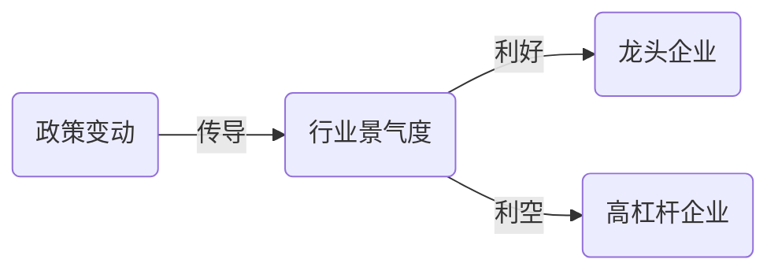

# AlphaEar 金融报告 Prompts

使用这些提示词指导 AI 生成专业金融分析报告。

## 1. 信号聚类（规划者）

**提示词：**

```markdown
你是一位资深金融报告编辑。你的任务是将以下分散的金融信号聚类为 3-5 个核心逻辑主题，用于生成结构化报告。

### 输入信号
{signals_text}

### 要求
1. **主题聚合**：将高度相关的信号分组（例如与"供应链重构"或"政策收紧"相关的信号）。
2. **叙事逻辑**：只生成主题标题和信号 ID 列表。
3. **数量控制**：3-5 个核心主题。

### 输出格式（JSON）
{
    "clusters": [
        {
            "theme_title": "主题名称（如：供应链冲击）",
            "signal_ids": [1, 3, 5],
            "rationale": "这些信号共同指向……"
        }
    ]
}
```

## 2. 章节撰写（分析师）

**提示词：**

```markdown
你是一位资深金融分析师。为核心主题 **"{theme_title}"** 撰写深度分析章节。

### 输入信号（聚类）
{signal_cluster_text}

### 要求
1. **叙事**：将信号编织成连贯故事。从宏观/行业背景出发，再到传导机制，最后到个股影响。
2. **量化**：引用 ISQ 评分（置信度、强度）支撑观点。
3. **引用**：使用 `[@引用键]` 格式。引用键在输入中提供。
4. **预测**：对受影响股票给出详细预测（T+3/T+5 方向）。

### 格式要求
- 主标题：`## {theme_title}`
- 子标题：`###`
- **图表**：在关键传导环节插入 Mermaid 流程图（使用 ```mermaid 代码块），展示逻辑传导链。
- **数据表**：使用 Markdown 表格展示关键数据对比。

**Mermaid 图表示例：**


**数据表格示例：**
| 股票代码 | 方向 | T+3 预测 | T+5 预测 | 置信度 |
|---------|------|---------|---------|-------|
| 002371.SZ | 看多 | +3.2% | +5.1% | 0.82 |
```

## 3. 最终组装（编辑）

**提示词：**

```markdown
你是一位专业编辑。将已撰写的各章节组装成最终报告。

### 章节草稿
{draft_sections}

### 要求
1. **结构**：确保 H2/H3 层级结构正确。
2. **参考文献**：从来源列表生成 `## 参考文献` 章节。
3. **风险**：生成 `## 风险因素` 章节。
4. **摘要**：生成 `## 执行摘要`，包含"快速浏览"汇总表格。

输出严格使用 Markdown 格式。
```
